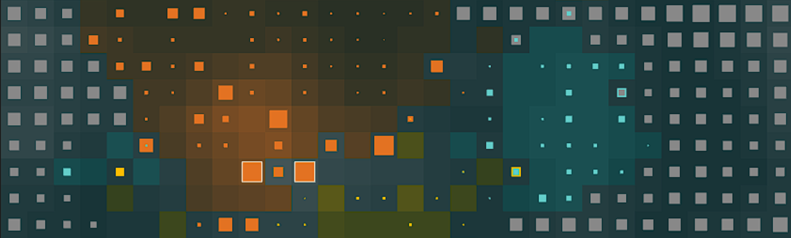
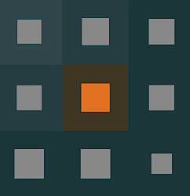
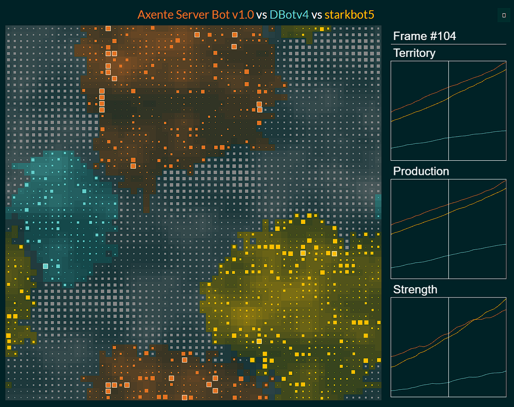

# Halite Bot - Axente Server Team

Axente Server Bot is a bot developed for the **Halite** game (*2016-2017* vesion). Halite is a multiplayer game where players write bots to compete for control of a grid-based map. The bot uses advanced pathfinding and decision-making algorithms to control game units and strategically conquer territory.

This bot employs techniques such as *A search**, *dynamic frontier detection*, *strength-based movement*, and *coordinated multi-unit actions*. It focuses on border expansion, production management, and tactical dominance over neutral and enemy squares. Using this strategy we were able to achieve a **top 25%** ranking in the Halite competition at Politehnica University of Bucharest.

## Table of Contents

- [Halite Game Description](#halite-game-description)
- [Bot Key Features](#bot-key-features)
- [Bot Strategy](#bot-strategy)
- [Core Functions](#core-functions)
- [How to Run](#how-to-run)
- [Interface](#interface)
- [Credits](#credits)

## Halite Game Description

Halite is an AI programming competition. Contestants write bots to play an original multi-player turn-based strategy game played on a square grid.

**Game Objective**: The objective of the game is to control as much territory as possible by moving units to conquer neutral and enemy squares.

**Squares**: The game map consists of square cells, each with a strength value and a production value. The strength value represents the unit's power, while the production value determines how quickly the strength value increases.

**Movement**: Units can move in four directions: up, down, left, and right. Units can move to adjacent squares if they have sufficient strength to conquer the target square, reinforce a friendly square or attack an enemy square and decrease their strength if outmatched.



## Bot Key Features

- **A Pathfinding***: Utilizes the A* algorithm to calculate optimal paths towards target squares, improving movement efficiency.

<br>

- **Dynamic Frontier Detection**: Identifies frontier squares—those on the edge of owned territory and prioritizes moves to expand efficiently.

<br>

- **Strength Management**: Units are coordinated based on their strength and proximity to targets to avoid overcommitting or wasting strength.

<br>

- **Multi-Unit Cooperation**: Multiple neighboring units can be moved in coordination to overtake strong enemy squares or strengthen defenses.

<br>

- **Production Efficiency**: The bot ensures squares with high production are prioritized for staying still to accumulate strength.

## Bot Strategy

<span style="color: #fffff; font-family: Babas; font-size: 1.5em;">Frontier Expansion:</span>

  - The bot identifies frontier squares adjacent to enemy or neutral territory and focuses on expanding the bot's control.
It calculates a "score" for each frontier square based on its production, strength, and proximity to valuable targets.

<span style="color: #fffff; font-family: Babas; font-size: 1.5em;">Unit Movement:</span>

  - Units near the frontier are moved either toward the enemy or into neutral squares depending on their strength and the surrounding situation.
  - The bot employs an A search* for units that are far from the front, allowing them to navigate complex maps effectively.

<span style="color: #fffff; font-family: Babas; font-size: 1.5em;">Coordination Between Units:</span>

  - Neighboring units cooperate to combine their strengths and conquer stronger enemy territories.
  - The bot handles situations where individual unit strength may not be enough by grouping nearby units and making coordinated movements.

<span style="color: #fffff; font-family: Babas; font-size: 1.5em;">Strength Management:</span>

  - Units remain still to accumulate strength when required, especially when their strength is below a specific threshold or the square they occupy has high production.
  - The bot ensures efficient use of unit strength, avoiding unnecessary movement or wastage.

<span style="color: #fffff; font-family: Babas; font-size: 1.5em;">Avoiding Overextension:</span>

  - The bot avoids expanding too quickly without proper strength, balancing production and territorial growth to prevent overextension.

## Core Functions

 * `check_close_to_frontier(square)`: Checks if a square is close to the frontier.

<br>

 * `strength_after_steps(square, steps)`: Calculates the strength of a square after a given number of steps.

<br>

 * `a_star_search(start, goal)`: Implements the A* algorithm to find the shortest path between two squares. The algorithm uses a priority queue which is updated based on the *manhattan distance* to the goal and the cost to reach the current square. Manhattan distance is a metric used to determine the distance between two points in a grid-like path

<br>

 * `find_goal_square(square)`: Searches for nearby enemy or neutral squares to target.

<br>

* `find_moves_for_two_strongest_neighbors`: Determines the moves for the two strongest neighbors of a given square, so they can overcome the target square's strength.

<br>

* `find_moves_for_three_strongest_neighbors`: Determines the moves for the three strongest neighbors of a given square, so they can overcome the target square's strength.

<br>


* `get_neigh_and_op_dir(square, steps)`: Returns the neighbors and the opposite direction (in order to know where we come from) for a given square.

<br>

 * `get_score(square)`: Calculates a score for each frontier square based on production, strength, and proximity to neutral/enemy squares.
      * If the square belongs to the bot (`square.owner == myID`), the function **returns -1**. This ensures that squares already owned by the bot are not prioritized.

      * **Production Score**: The `production_score` is set as the production value of the square (`square.production`).

      * **Strength Penalty**: `strength_penalty` is calculated as the ratio between the square's strength (`square.strength`) and its production (`max(1, square.production)`). The `max(1, square.production)` is used to avoid **division by zero**.

      * **Proximity Bonus**: The function evaluates the square's neighbors and calculates two bonuses:
          * `neutral_bonus`: Adds 2 for each neutral neighbor (`neighbor.owner == 0`).
          * `enemy_bonus`: Adds 3 for each enemy neighbor (`neighbor.owner != myID`).

      * **Border Proximity Bonus**: `border_proximity_bonus` adds a bonus of 5 if there is at least one neighbor that does not belong to the bot `(neighbor.owner != myID)`.

<br>

 * `find_closest_frontier(square)`: Identifies the closest frontier square to a given unit.
    * For each direction, the function calculates the distance until it finds a square that is not owned by the player (`myID`) or reaches the defined boundary.
    * Calculating the Distance to an Enemy:
        * `distances_to_enemies` is used to measure the distance from the frontier to the nearest enemy-controlled square or until a maximum distance (`max_difference`) is reached.
        * If a frontier is reached before the boundary and that square is neutral (`owner == 0`), the function continues in that direction until it encounters an enemy or reaches the maximum allowed distance.
    * Finding the Optimal Direction:
        * The function compares the total distances (**to the frontier + to the enemy**) and finds the direction with the smallest distance.
    * Returning the Direction:
        * The function returns the direction the player should move to reach a favorable frontier as quickly as possible.

<br>

 * `check_if_move_is_possible(square, steps)`: Determines if a move is feasible based on a unit's strength and available neighboring units.
    * It gets the neighbors and opposite directions for the given square (`square`).
    * If the strength of the strongest neighbor (`biggest[0]`) after `steps` is greater than the strength of the target square (`square.strength`), it adds that move to `moves`.
    * If the move is not possible with just the strongest neighbor, it uses `find_moves_for_two_strongest_neighbors` to determine the moves.
    * If this also fails, it uses `find_moves_for_three_strongest_neighbors`.
    * It updates the `visited matrix` to mark the squares that will be moved.

## How to Run

> Firstly, clone the repository to your local machine and install python3.

<br>

> To run the bot on different maps, use the following command:

```bash
# Example for running a single bot on a 15x20 map with seed 42
./halite -d "15 20" -n 1 -s 42 "python3 MyBot.py"

# Example for running multiple bots on a 60x60 map
./halite -d "60 60" "python3 MyBot.py" bots/DBotv4_linux_x64 bots/starkbot_linux_x64 
```
* `-d` flag specifies the dimensions of the map.
* `-n` flag specifies the number of bots (only used when you are running a single bot). `remove` this flag when running multiple bots.
* `-s` flag specifies the seed for the map generation. (optional)
* `python3 MyBot.py` runs the bot on the Halite game engine. You need to specify `python3` or `java` based on the language you are using. If you are running in C++, you can directly run the executable file.

<br>

> After running the command, the game engine will generate a replay file that you can visualize using the following command:

```bash
python3 .\vis.py msedge .\20x15-1-42.hlt
```

* `python3 .\vis.py` runs the visualization script.
* `msedge` specifies the browser to use for visualization. You can use any browser installed on your system.
* `.\20x15-1-42.hlt` specifies the path to the replay file you want to visualize.

## Interface

The browser interface displays the game map, the player's, the current frame and three graphs showing each player's strength, production, and territory. The controls for the interface are as follows:
  * **Space** pauses and plays.
  * **Left** and **Right** arrows navigate through the game.
  * **Up** and **Down** arrows change the speed of playback.
  * **Plus (+)** and **Minus (-)** zoom in and out on the graphs.
  * **Z** and **X** jump to the beginning and end of the game.
  * **P** shows the production heatmap onscreen.
  * **W, A, S, and D** pan the view around the map. O recenters the the origin.
  * **Comma and Period** (< and >) navigate through the game by a single frame.
  * One can also click on the graphs to navigate through the game.



## Credits
- The bot was developed by the Axente Server Team. The team members are [Victor](https://github.com/Viktor09), [Robert](https://github.com/robertpaulp) and [Rares](https://github.com/rrsmart8).

- The resources used for developing the bot are:
    - https://en.wikipedia.org/wiki/A*_search_algorithm
    - https://github.com/mihneablotiu/HaliteBot---FirstForce